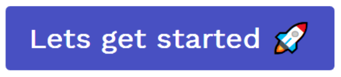

# Frontend master

This module will teach you **frontend webdevelopment in 15 weeks**. We will start with a **solid understanding of Javascript**. On top of that solid Javascript foundation we will **teach you React**. The course will be focused on **creating fun diverse smaller projects** that will teach you the topics for the individual weeks. 

## Course overview

The course will consist of 6 different parts that will cover necessary topics of learning frontend development. Here is the overview of the topics 👇

*Styling and layout for the overviews taken from https://threejs-journey.xyz/*

---

## Structure of classes

The classes will be run with minimal teaching so you can focus on learning through doing. It will be structured with 

## Projects

These are some of the projects you will be building

- Netflix clone
- 

  

