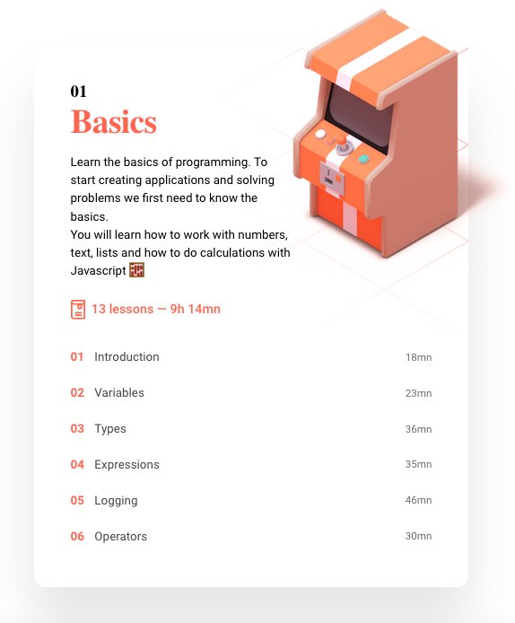

# Frontend master

This module will teach you frontend development in 15 weeks. We will start with a solid understanding of Javascript. On top of that solid Javascript foundation we will teach you React. The course will be focused on creating fun diverse smaller projects that will teach you the topics for the individual weeks. 

