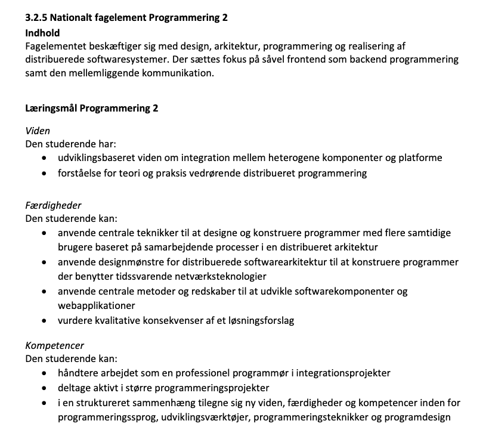

# Studieordning for programmering 2 (3. semester)

Distirbueret system: Distribueret system er et meget bredt begreb. Det dækker over applikationer, hvor data er delt over flere computere.

## Møde omkring 3. semester

Overvej at blande sammen med systemplanlægning

Projekt efter 6 uger. 

- Spring Security
- Overvej sockets
- Glem ikke computer science topics
- Alle klasser har ikke lært rest godtnok. GET, POST, PUT, PATCH DELETE
  - Hvordan kan man sende data gennem GET request, der kan de ikke de forskellige måder
- 

Anders og Erik og Benjamin laver fællesplan efter Tomas og Benjamin's plan

Det er vigtigt at vi er afklarede med hvilke kompetencer der kommer videre

