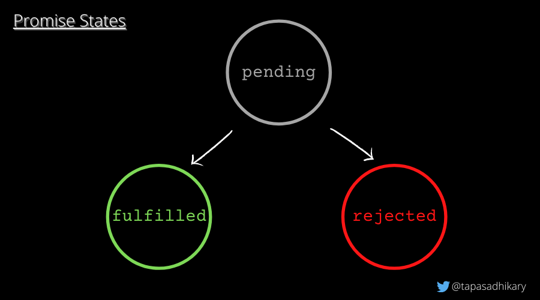
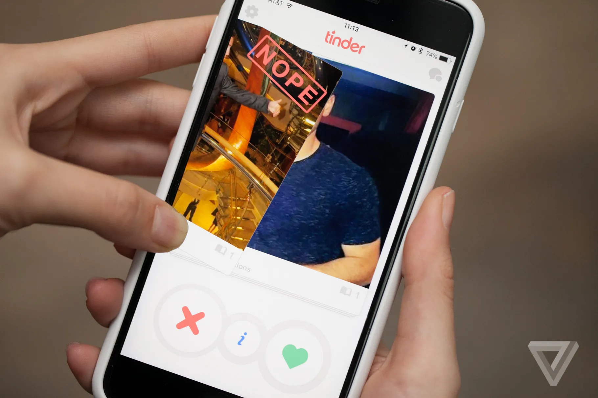

# Async

Support video async js: [https://youtu.be/RTrua6CRNEM](https://youtu.be/RTrua6CRNEM)

Support video callbacks: [https://youtu.be/hjgunSqSPaA](https://youtu.be/hjgunSqSPaA)

Support video using promises: [https://youtu.be/G4YSi6VA2gw](https://youtu.be/G4YSi6VA2gw)

Support video using async await: [https://youtu.be/6Hq6AywZ7FY](https://youtu.be/6Hq6AywZ7FY)


Asynchronous programming is for some the hardest part of Javascript. But throughout this course you have actually worked with asynchronous programming but probably without you noticing it! Here are two examples:

1. `addEventListener` - this method will call another method when some event happens
2. `fetch` - this method will fetch some data and when that data is fetched it will call a method

This is what essentially asynchronous programming in Javascript is: You set up a function that will wait until something happens (a button is clicked, some data is fetched, a countdown is done and so on). When that something happens a function that you gave the other function will get called. This is also the concept behind a callback function.


## `setTimeout`/`setInterval`

The `setTimeout` method will wait some time before calling a function

```javascript
setTimeout(function() {
  console.log("This is logged after 3 seconds");
}, 3000);
```

`setTimeout` takes two arguments

1. The function you want to run when the time is up (the callback function)
2. The number of milliseconds before the callback function will be called


The `setInterval` will works nearly like the `setTimeout` function it just keeps calling the callback function for every milliseconds you specify

```javascript
setinterval(function() {
  console.log("This is logged every 3 seconds");
}, 3000);
```


## Promise usage

Remember last class when we were working with `fetch`. Now we will get a bit more into the details of using a `promise`.

Just like a function which can be both created and called. The same is true for a `promise`. We will be focusing on the usage part of a `promise`. If you want to know how to create your own promise then take a look at this youtube video: https://www.youtube.com/watch?v=Y-aWVUAul9w


### What exactly is a promise?

A promise is a technique for working with asynchronous code. Promises makes it easier and more simple to work with asynchronous code. It came out of a frustration regarding something called [callback hell](http://callbackhell.com/) where working with asynchronous code would make you create code like you can see below 👇 This can in a real world situation be hard to get an overview of


So to fix the problems callback hell gave us, in came promises ☀️


### Let's talk more about promises

A promise can be in 3 states

- `pending` -  The promise has started
- `fulfilled` - The promise is resolved
- `rejected` - The promise is rejected




If you have a variable that is a `promise` there are two functions you can call on that `promise`. Both these functions takes another function as argument!https://media.giphy.com/media/FcuiZUneg1YRAu1lH2/giphy.gif

1. `.then(successFunction)` - The method that you provide to the `.then` method will get called when the asynchronous task **is successful!** That method in this example is `successFunction`. In promise terms we say that the method is fulfilled or resolved
2. `.catch(errorFunction)` - The method that you provide to the `.catch` method will get called when the asynchronous task **is not successful!**. That method in this example is `errorFunction`. Here the promise is rejected


Here is another way to show the two sides of promises


### Real world example of a promise

Okay so now you know why promises came about. Let's look at an example from my previous work:

I was working at a dating website. I had to write the functionality for being able to swipe profiles. Since swiping is an asynchronous task (you swipe then wait for the card to be animated out) i chose to implement this functionality as a `promise`. What had to be done was that after the card was swiped out, the next card had to be animated into sight. The code looked kind of like this:




```javascript
// calling the swipeCard method will return a promise
const swipePromise = swipeCard();
swipePromise
  .then(() => {
  	// code for animating the next profile into view
	});

	// This can be simplified like this👇
	swipeCard()
    .then(() => {
    	// code for animating the next profile into view
  	});
```

So we call a method called `swipeCard`. This method will start the animation of the card and then return a `promise`. When the card is animated the returned promise would fulfill/resolve


Let's take another example you have been working with:

````javascript
fetch('some-url')
  .then((response) => response.json())
  .catch((error) => console.log(error));
	
// the same could be written like this
const fetchPromise = fetch('some-url');
fetchPromise
	// this method will be called when the server responds!
  .then((response) => response.json())
  .catch((error) => console.log(error));
````

Calling the `fetch` function will make a request to a server and then return a `promise`. When the server responds, the promise will resolve. That means that the method that was given to  `.then` will be called. If the promise is not successful the function given to the `.catch` method will be called. That could happen if a user goes through a tunnel cutting his connection while the `fetch` method was trying to get the response. 


### Promise chaining

But the examples with `fetch` you have worked with are a bit different, they look like this 👇

```javascript
fetch('some-url')
  .then((response) => response.json())
  .then((data) => console.log(data))
  .catch((error) => console.log(error));
```

How can this be done? Every call to `.then` will return a new promise! We can let's make that a bit more clear:

```javascript
const firstPromise = fetch('some-url');
const secondpromise = firstPromise.then((response) => response.json());
const thirdpromise = secondpromise.then((data) => console.log(data));
thirdpromise.catch((error) => console.log(error));
```


## Exercises


### Exercise 1

Create a function that when called will wait for 3 seconds and the log out some text


### Exercise 2

Create a function that takes 2 parameters: `delay` and `textToLog`. 

Calling this function should log out the `textToLog` after `delay` seconds. Try use the function with some different texts and delays


### Exercise 3

Create a button in html. When clicking this button, use the function you created in the previous task to log out the text: `Called after 5 seconds` 5 seconds after the button is clicked.


### Exercise 4

Fetch movies using this [api](https://gist.githubusercontent.com/pankaj28843/08f397fcea7c760a99206bcb0ae8d0a4/raw/02d8bc9ec9a73e463b13c44df77a87255def5ab9/movies.json)

1. Log out all the movies
2. Render the movies to the DOM
3. Create a checkbox. When the checkbox is checked, show new movies when the checkbox is not checked show old movies
4. Create search functionality so i as a user can search for a movie name and see the movies that match what was searched for
5. Create a select box of movie genres. When selecting a genre only movies that has that genre should be shown

*Exercises inspired and taken from https://github.com/HackYourFuture-CPH/JavaScript*

