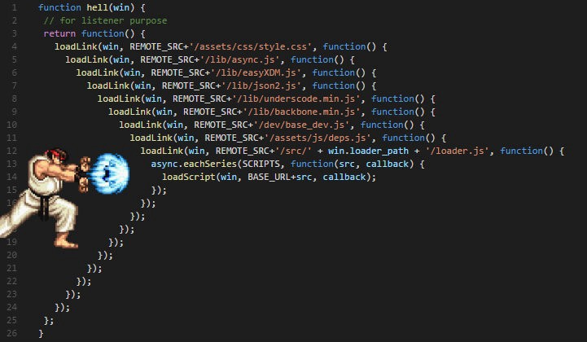

# Async

Support video: https://youtu.be/RTrua6CRNEM

Support video callbacks: https://youtu.be/hjgunSqSPaA


Asynchronous programming is for some the hardest part of Javascript. But throughout this course you have actually worked with asynchronous programming but probably without you noticing it! Here are two examples:

1. `addEventListener` - this method will call another method some event happens
2. `fetch` - this method will fetch some data and when that data is fetched it will call a method

This is what essentially asynchronous programming in Javascript is: You set up a function that will wait until something happens (a button is clicked, some data is fetched, a countdown is done and so on). When that something happens a function that you gave the other function will get called. This is also the concept behind a callback function that we briefly talked about.


## `setTimeout`/`setInterval`

The `setTimeout` method will wait some time before calling a method.

```js
setTimeout(function() {
	console.log("This is logged after 3 seconds");
}, 3000);
```

`setTimeout` takes two arguments. 

1. The function you want to run when the time is up (the callback function)
2. The number of milliseconds before the callback function will be called


The `setInterval` will works nearly like the `setTimeout` function it just keeps calling the callback function for every milliseconds you specify

```js
setinterval(function() {
	console.log("This is logged every 3 seconds");
}, 3000);
```


## Function can take another method

In Javascript functions work just like any other variable. That means that they can be added to an array, the can be given as an argument to antoher function or the can be the value of an object's key. 


Let's first take a look at this example. It is a number that gets thrown around in an array, as an object key, and as a parameter in a function.

```js
const someNumber = 2;

const methodArray = [someNumber, 6];

const functionObject = {
  numberKey: someNumber
}

function takesAnotherNumber(numberParameter) {
	console.log(numberParameter);
}

takesAnotherNumber(someNumber);
```


Now take a look at this example. Here what is being thrown around is not a number but a function. Because for Javascript there is no difference.

```js
const someFunction = function() {
	const age = 22;
	console.log(age);
}

const methodArray = [someFunction, function() {
  console.log("I am a function in an array");
}];

const functionObject = {
  functionKey: someFunction
}

function takesAnotherFunction(functionParameter) {
  functionParameter();
}

// In the example someFunction is acting as a callback function
takesAnotherFunction(someFunction);
```

This might be a bit mind bending, but is supposed to help with realizing that functions in Javascript is **just** like any other type.


## Promise usage

Remember last class when we were working with `fetch`. Now we will get a bit more into the details of using a `promise`.

Just like a function which can be both created and called. The same is true for a `promise`. We will be focusing on the usage side of creating a `promise`. If you want to know how to create your own promise then take a look at this youtube video: https://www.youtube.com/watch?v=Y-aWVUAul9w


### What exactly is a promise?

A promise is a technique for working with asynchronous code. Promises makes it easier and more simple to work with asynchronous code. It came out of a frustration of something called [callback hell](http://callbackhell.com/) where working with asynchronous code would make you create code like you can see below 👇 This can in a real world situation be hard to get an overview of



So to fix the problems callback hell gave us, in came promises ☀️


### Let's talk more about promises

Apromise can be in 3 states

- `pending` -  The promise has started
- `fulfilled` - The promise is resolved
- `rejected` - The promise is rejected


If you have a variable that is a `promise` there are two functions you can call on that `promise`. Both these functions takes another function as argument!

1. `.then(successFunction)` - The method that you provide to the `.then` method will get called when the asynchronous task **is successful!** That method in this example is `successFunction`. Here the promise is fulfilled or resolved
2. `.catch(errorFunction)` - The method that you provide to the `.catch` method will get called when the asynchronous task **is not successful!**. That method in this example is `errorFunction`. Here the promise is rejected


Here is another way to show the two sides of promises


### Real world example of a promise

Okay so now you know why promises came about. Let's look at an example from my previous work:

I was working at a dating website. I had to write the functionality for being able to swipe profiles. Since swiping is an asynchronous task (you swipe then wait for the card to be animated out) i chose to implement this functionality as a `promise`. What had to be done was that after the card was swiped out, the next card had to be animated into sight. The code looked kind of like this:


```js
// calling the swipeCard method will return a promise
const swipePromise = swipeCard();
swipePromise
	.then(() => {
		// code for animating the next profile into view
	});

// This can be simplified like this👇
swipeCard()
	.then(() => {
		// code for animating the next profile into view
	});
```

So we call a method called `swipeCard`. This method will start the animation of the card and then return a `promise`. When the card is animated out the function we gave to the `.then` method will be called!


Let's take another example you have been working with:

````js
fetch('some-url')
	.then((response) => response.json())
	.catch((error) => console.log(error));
	
// the same could be written like this
const fetchPromise = fetch('some-url');
fetchPromise
	// this method will be called when the server responds!
	.then((response) => response.json())
	.catch((error) => console.log(error));
````

Calling the `fetch` function will make a request to a server and then return a `promise`. When the server responds, the method that was given to  `.then` will be called. If the promise is not successful the function given to the `.catch` method will be called. That could fx be that a user goes through a tunnel cutting his connection while the `fetch` method was trying to get the response. 


### Promise chaining

But the examples with `fetch` you have worked with are a bit different, they look like this 👇

```js
fetch('some-url')
	.then((response) => response.json())
	.then((data) => console.log(data))
	.catch((error) => console.log(error));
```

How can this be done? Every call to `.then`will return a new promise! We can let's make that a bit more clear:

```js
const firstPromise = fetch('some-url');
const secondpromise = firstPromise.then((response) => response.json());
const thirdpromise = secondpromise.then((data) => console.log(data));
thirdpromise.catch((error) => console.log(error));
```


