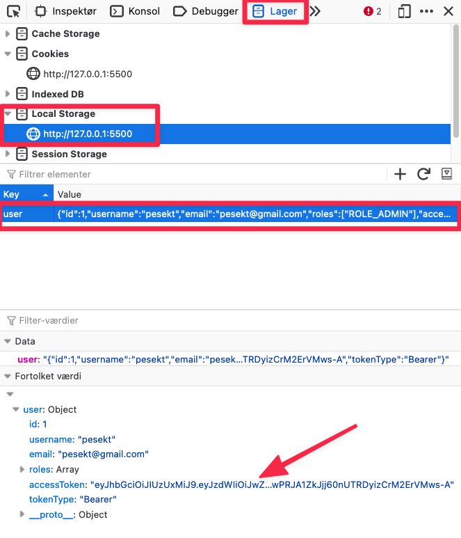

# User authentication using JWT

To authenticate a user in our application we will be using JWT (JSON Web Token). JSON Web Token (JWT) is an open standard ([RFC 7519](https://tools.ietf.org/html/rfc7519)) that defines a compact and self-contained way for securely transmitting information between parties as a JSON object. You can read more about JWT here: https://jwt.io/


You have already been working with JWT on the backend side of things. Here we will look at how to use the backend api to log in a user.


This is how we will be working with JWT in the frontend

1. First we will ask the backend for a JWT Token using a `username` and `password`. This happens when logging in. It basically goes like this: 
   Frontend: "Hey API can i please get a JWT token for the user with this `username` and this `password`?"
   API: "Off course frontend, here you go! You can find the token under the `data` key in my response!"
   Frontend: "Thanks API i found it! I will just save it locally in my `localStorage` so i can use it later "
2. Now with the token in `localStorage` everytime we ask the API for data we will send the token along to say that we are who we are.
   Frontend: "Hey api can you give me a list of my social media posts? I have attached my token in the request!"
   API: "Yeah off course! I can see that you are who you say you are from the token. Here is your social media posts! "


Here is a diagram of the same flow 👇


One extra thing we can see from this diagram is that the JWT token is sent through the header of the request. Let's get a bit closer to an actual implementation!


 ### Implementing authentication using JWT

#### Saving JWT token on login

Let's start with the login part where we get and save a token:

```javascript
function login(username, password) {
  // endpoint for logging in
  const apiUrl = "auth/signin";
  fetch(apiUrl, {
    method: "POST",
    body: JSON.stringify({
      username: username,
      password: password,
    }),
    headers: {
      "Content-type": "application/json; charset=UTF-8",
    },
  })
    .then((response) => response.json())
    .then((response) => {
      if (response.data.accessToken) {
        // Saving the JWT to local storage
        localStorage.setItem("user", JSON.stringify(response.data));
      }
  });
}
```

We have seen the `POST` request before. The `auth/signin` off course depends on where you have set your login endpoint up. 

Where the magic 🪄 happens are in these lines 👇

```javascript
if (response.data.accessToken) {
	localStorage.setItem("user", JSON.stringify(response.data));
}
```

We first check if the `accessToken` is there. If it is, we take the response, encode it to a JSON string with `JSON.stringify` and then save the JSONified token in `localStorage` (under the `user` key) using `localStorage.setItem`. We have now saved the token in locally! You can read more about `localStorage` here: https://developer.mozilla.org/en-US/docs/Web/API/Window/localStorage


We can even see what we save in localatorage, especially the `accessToken`!




#### Attaching the token to a request

In this example we will getting some imaginary social media posts. This endpoint is only available for logged in users!

```javascript
// endpoint only available for a logged in user!
const apiUrl = '/social-media-posts';
// Get the JWT token from local storage
const userJWTToken = JSON.parse(localStorage.getItem("user"));
fetch(apiUrl, 
    headers: {
      "Content-type": "application/json; charset=UTF-8",
      // attaching the JWT token to the request in the headers!
      "Authorization": "Bearer " + userJWTToken.accessToken,
    },
  )
  .then(response => response.json())
  .then(socialMediaPosts => {
    console.log(socialMediaPosts);
  })
	.catch((error) => {
    console.log('Some error occured');
    console.log(error);
  });
```

-  The first thing we do is get the JWT token from `localStorage` using `localStorage.getItem`, using the key `user` where the token was saved.
-  Then we make a `GET` request using `fetch` (the default request is the `GET` request). Now in the `headers` of the request we add a new header called `Authorization`. This is where we attach the token! We have to remember to add the `Bearer  ` before we add the token (for some reason 🤷‍♀️) 
-  Now we get access to the `socialMediaPosts`. This is the API that will check if he token we sent is valid. If it is we get the `socialMediaPosts` otherwise we would get an error.

One thing to be very aware of here is that there might not be a JWT token in `localStorage`. If not this code will throw an error. Therefore this code needs to be rewritten a bit to work properly. 

