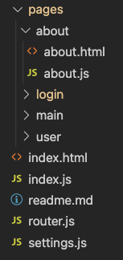

# Connecting frontend to backend api

Today we will be talking about connecting the backend code you wrote with the frontend code! 

The project i will be referencing can be found here: https://github.com/behu-kea/fullstact-frontend

Read about [authentication](authentication.md) before continuing


## CORS

Remember to add CORS to both your frontend localhost url and your frontend deployed url to the server 

This is done in the `config/WebConfig.java` file

```java
@Override
public void addCorsMappings(CorsRegistry registry) {
    registry
            .addMapping("/**")
            .allowedOrigins(
                    "http://localhost:5500",
                    "http://127.0.0.1:5500",
                    "https://flawless-branch.surge.sh")
            .allowedMethods("GET", "POST", "PUT", "DELETE", "PATCH")
            .allowCredentials(true)
            .maxAge(3600); //1 hour
}
```

- http://localhost:5500 and http://127.0.0.1:5500 are the development url's
- https://flawless-branch.surge.sh is the deployed url

Now you can interact (CRUD) with the api


## Structure

The structure looks like this



In this structure the `index.html` loads the `index.js` file. 

The `index.js` file loads the settings and starts the router

```javascript
import settings from "./settings.js";
import startRouter from "./router.js";

settings();
startRouter();
```


### Settings

In the [settings.js](https://github.com/behu-kea/fullstact-frontend/blob/master/settings.js) we set the url for the api

```javascript
export default function () {
  const isLocalhost =
    window.location.host.indexOf("127.0.0.1") != -1 ||
    window.location.host.indexOf("localhost") != -1;

  const localApiUrl = "http://localhost:5552";
  const prodApiUrl = "https://tomas-order-site.herokuapp.com";

  // when fetching data from the api we need to know what the url is
  // It is different if you are developing locally or have the site deployed
  window.apiUrl = isLocalhost ? localApiUrl : prodApiUrl;
}

```

If the url of the site includes `127.0.0.1` or `localhost` then we know the project is running on locally. Therefore we use the url for the api running locally.  Otherwise we use the production api url. 

`window.apiUrl` sets a key on the `window` object. This object can be reached everywhere in the application. So its a very global variable. It is used when using `fetch`: `fetch(${window.apiUrl}/api/orders)`


### Login

The login functionality works by listening for an `submit`event on the `form`. When the `form` is submitted the a `POST` request is made to the api using `fetch`. The username and password comes from the two `input` fields. When the api responds with the JWT token, that token is saved in `localStorage`. Lastly it navigates to a user page for the loggedin user. 

```javascript
form.addEventListener("submit", (event) => {
    // Make sure the form is not submitted
    event.preventDefault();

    fetch(`${window.apiUrl}/api/auth/signin`, {
      method: "POST",
      headers: {
        "Content-Type": "application/json",
      },
      body: JSON.stringify({
        username: document.querySelector("input.username").value,
        password: document.querySelector("input.password").value,
      }),
    })
      .then((response) => response.json())
      .then((data) => {
        if (data.accessToken) {
          // Saving the JWT to local storage
          localStorage.setItem("user", JSON.stringify(data));
          // navigating to the users route. Using the global window.router
          window.router.navigate(`/user/${data.id}`);
        }
      });
  });
```


### User

The user page get's the userId from Navigo. 

The user page changes the `h2` tag and then renders some orders.

```javascript
fetch(`${window.apiUrl}/api/orders`, {
  headers: {
    "Content-type": "application/json; charset=UTF-8",
    // attaching the JWT token to the request
    Authorization: "Bearer " + userJWTToken.accessToken,
  },
})
  .then((response) => response.json())
// Yes we can do like this. The data from the api is the argument to renderOrders!
  .then(renderOrders);
```

For accessing the orders endpoint it must send the JWT token with the request. That is becaused you have to be authenticated to have access to that page. Look into  [authentication](authentication.md) if this is not clear to you