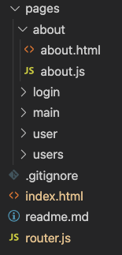

# Frontend structure

Building a frontend application using vanilla (pure) js can be done and is done in 1000 different ways. The approach taken here is what makes sense for me, hopefully it will for you to. If not feel free to create your own structure!

Here is the repo: https://github.com/behu-kea/navigo-routing-simple

Read about [routing](routing.md) before continuing on this page

## Overall structure

The overall structure of the application looks like this 👇

- The `pages` - folder contains the different pages in the application. each page has an html file and a js file
- `.gitignore` - contains the files that should not be included in the git repo (`.DS_Store` fx)
- `index.html` - contains the `content` div, loads navigo and the main js file `index.js`
- `router.js` - contains the router