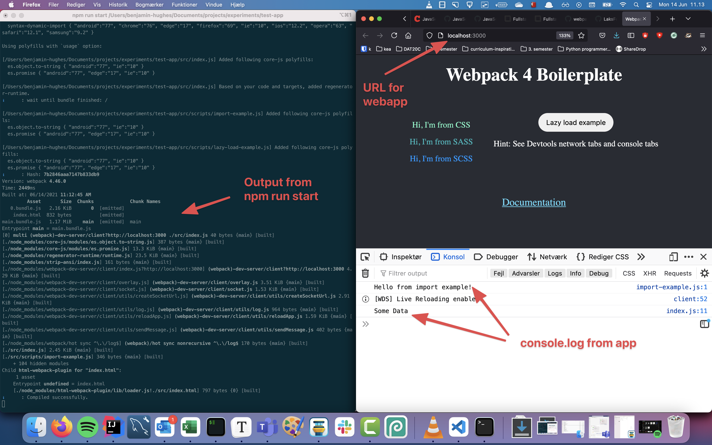
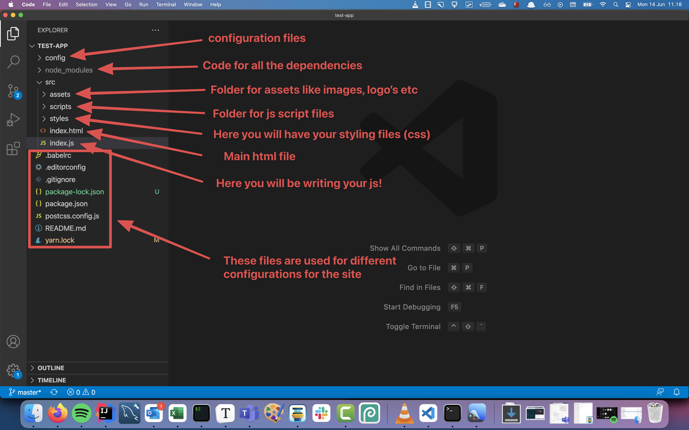

# Getting started

In this course we will be developing js through the browser. lets create our first application :) 


## Install you webapp

There are roughly two ways of building Javascript apps

1. You reference a Javascript file in your html (exactly like you do with your css file)
2. You let a tool (webpack) help you with adding Javascript to the browser. Since this is what we will be using when developing React app's, we will chose this approach for our Javascript aswell


We will be using a boilerplate which is some code someone else wrote that will help us quickly getting started. We will be using this boilerplate: https://github.com/LaksForks/vanilla-js-boilerplate

To get this code on to your machine go to a terminal, navigate to where you want to have your Javascript project using `cd`. Now write thes commands


Install `webpack-dev-server` that we need for the project:

```js
npm install webpack-dev-server -g
```

Glone the project down on your computer. **Remember** to change `YOUR_APP_NAME_GOES_HERE`!

```
git clone https://github.com/LaksForks/vanilla-js-boilerplate.git YOUR_APP_NAME_GOES_HERE
```

Move into the folder that has your app

```
cd YOUR_APP_NAME_GOES_HERE
```

Install all the dependencies for the project

```
npm install
```

Run the project (this will open a webpage where your code will be available)

```
npm run start
```


If you get an error saying `gyp: No Xcode or CLT version detected!`

https://stackoverflow.com/a/60982835

Open the default mac ternimal

```sh
xcode-select --print-path
# in my case /Library/Developer/CommandLineTools

# the next line deletes the path returned by the command above
sudo rm -rf $(xcode-select --print-path)

# install them (again) if you don't get a default installation prompt
xcode-select --install
```


## Getting started with building webapps using Webpack

Webpackis the tool that will help us developing Javascript. It's called a bundler and will take all the javascript we wrote, optimize and minimize it. Put the optimized javascript, css and html in a new folder called `build`. 

The javascript you will be building will be in the `src/index.js` file. There is already some code in the `index.js` file. You can just delete that! 

Your can find the console of your app go to `http://localhost:3000/`. To see the console right click on the browser and choose `Inpspect Element` -> click on `Console` or `Konsol` (based on your language)



When changing the js the webapp will **automatically reload with the changes!**


## Building webapps

For this class we will be using Visual Studio Code as our IDE. Download it here: https://code.visualstudio.com/download 

Open the webapp in Visual Studio Code. Now there will be quite a lot of files and folders here! The only one that is relevant for now is the `src/index.js` file. You can delete what is already there! 

I have made an image showing what the different folders and files are for. Dont worry about it too much though!




## Exercise - 1

*(This exercise will help you expand your understanding of console.log)*

Log 10 statements like these to the console, but in different languages.

For example:

```
Halo, dunia! // Indonesian
Ciao, mondo! // Italian
Hola, mundo! // Spanish
```

*Exercise taken from [CodeYourFuture](https://syllabus.codeyourfuture.io/js-core-1/week-1/lesson)*

