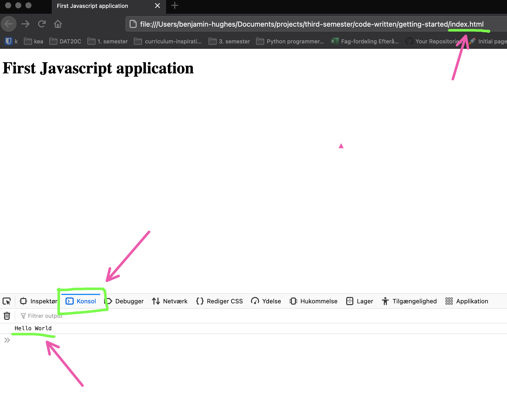

# Getting started

In this course we will be developing js through the browser. lets create our first application :) 

Create a new folder where you will have your application. fx `first-application`

In this folder you will have two files

1. `index.html` - the file containing the html and the link to our javascript file!
2. `main.js` - the file containing all the Javascript code you will be writing


**index.html**

```html
<!DOCTYPE html>
<html lang="en">
<head>
    <meta charset="UTF-8">
    <meta name="viewport" content="width=device-width, initial-scale=1.0">
    <title>First Javascript application</title>
</head>
<body>
    <script src="main.js"></script>
</body>
</html>
```

The important part of this html file is the `<script src="main.js"></script>`. This will load the `main.js` Javascript file and run it in the browser. So to run the Javascript file, simply open the `index.html` in your browser of choice. 


**main.js**

```js
console.log("Hello World");
```

This will `log` the text `Hello world` to the `console`. 


> To find the console open the browserdeveloper tools. Depending on which browser you are it might be a bit diferent. Generally right click -> Inspect Element -> Then click on the Console





## Exercise - 1

*(This exercise will help you expand your understanding of console.log)*

Log 10 statements like these to the console, but in different languages.

For example:

```
Halo, dunia! // Indonesian
Ciao, mondo! // Italian
Hola, mundo! // Spanish
```

*Exercise taken from [CodeYourFuture](https://syllabus.codeyourfuture.io/js-core-1/week-1/lesson)*

