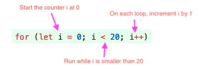

# Loops

When we're writing programs, we often find that we want to repeat a bit  of code over and over, or repeat it but change something about it each  time. To save ourselves from writing all that code, we can use a **loop**. JavaScript has two kinds of loops, a `while` loop and a `for` loop. I will only cover the `for` loop. 


### for loop

The `for` loop is similar to a while loop, but with a more specialized syntax.  Programmers invented the for loop when they realized they were always  doing the same three things: creating loop counter variables (like `i` above), incrementing them by some amount, and checking that they're less than a value.

The `for` loop syntax has special places for each of those three things. Here's  the same loop as the first while loop above, as a for loop:



```javascript
for (let i = 0; i < 20; i++) {
	console.log(i);
}
```


### Exercise (10 minutes)

##### Exercise

Write a function, similar to the last exercise, that:

- Takes one number `n` as a parameter
- Adds all numbers from `0` to `n`. For example, if the input is `3`, the output should be `0 + 1 + 2 + 3`
- You should use an for loop


This page about loops has been taken from https://syllabus.codeyourfuture.io/js-core-1/week-2/lesson#loops

