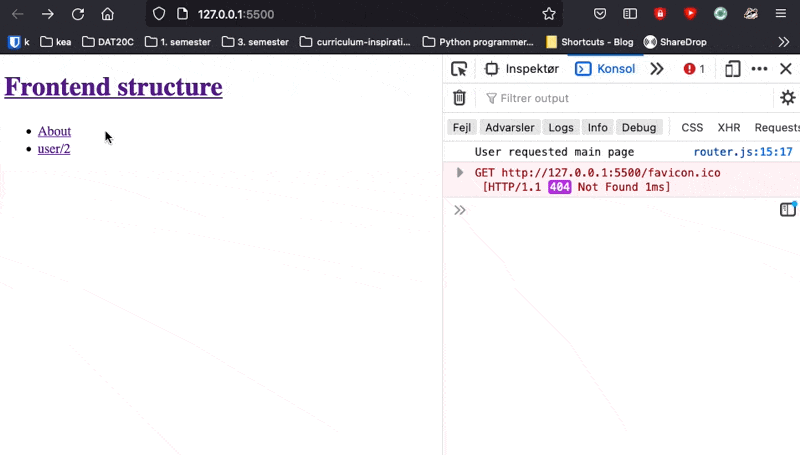
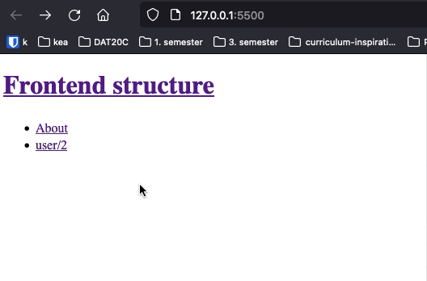
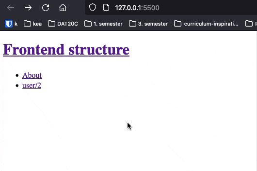

# Routing

Routing is the process of redirecting a user to the correct page. Routing can be done both in the frontend and in the backend of the application. Since we will only use the backend server for the api, then we need to do the routing in the frontend


There are lots of ways to do this! For this course we will be using navigo: https://github.com/krasimir/navigo


## Navigo


### Install navigo

To get access to navigo add this line before you load the rest of your javascript in your html file: `<script src="//unpkg.com/navigo"></script>`

```html
<body>
  <script src="//unpkg.com/navigo"></script>
  <script src="router.js"></script>
</body>
```

Now in your `router.js` file

```javascript
const router = new Navigo("/", { hash: true });
router
  .on({
  	"/": () => {
      console.log('User requested main page');
    },
    "about": () => {
      console.log('User requested the about page');
    },
    "/user/:id/": ({ data }) => {
      console.log('User requested user page with id ' + data.id);
    },
	})
  .resolve();
}
```

There are a couple of things to comment in the code above

- `const router = new Navigo("/", { hash: true });` here we create a new navigo instance. The first paramter refers to the root of the project. The second refers to the way the urls should look like. Look at the Hash routing section below

-  `router.on` takes an object where the keys is possible url's of the page. 

  ```javascript
  "about": () => {
    console.log('User requested the about page');
  },
  ```

  This code attaches a url called `about`. When a user navigates to `/about` the text `User requested the about page` will get logged

- `"/user/:id/": ({ data }) => ` This will register a url where the user can write the following `user/3`. Using `data.id` we can get the id the user wrote. This part `{ data }` is called destructuring, you don't need to know how that works.

- The `.resolve();` is a technicality of navigo. Not entirely sure why it is needed


Okay, so what we have created so far is just some routes and when a user goes to those routes we log something out. 



But that's not really super helpful for a user.  A user off course wants to see some html regarding the about page. 


### Changing the html

So we need to write some html that when going to a specific page also renders some html. Again this can be done in lots of different ways. Let's talk about how we do it 👇


This is the `index.html`

```html
<body>
  <div class="content"></div>
  <script src="//unpkg.com/navigo"></script>
  <script src="router.js" type="module"></script>
</body>
```

The div with class `content` is where we will be rendering the individual pages! 

This is the algorithm for when a user navigates to a specific url like `/about`

1. Select the `content` div
2. Set the `innerHTML` of the content div to the html for the new page. This will automatically remove the html that was already there from the last page the user visited!

So we are actually doing all the hard work of writing the router in some sense


**`index.js`**

```javascript
about: () => {
  const content = document.querySelector(".content");
  content.innerHTML = "<h1>This is the about page</h1><h2>This page was created back in 1992</h2>";
},
```



We are really staring to get far now 💪 But we have a problem. 


When a user reloads the page on fx `/about` this error is shown `Cannot GET /about`. That is because the browser is trying to find the route or the ressource (about.html) on the server. But since we only have `index.html` that is served on this path `http://127.0.0.1:5500/` then the browser throws the error! Its basiscally saying "I cannot fint the `about.html` file"


So what do we then do. We make hash routes👇


### Hash routing

When using hash routing the urls look a bit different fx: http://127.0.0.1:5500/#/about The `/#` will not make the browser look for a new file, but simply still use the `index.html` which we are very happy about because that is where our whole application is running. 

To setup that we initiate the `navigo` router like this: 

```javascript
const router = new Navigo("/", { hash: true });
```



