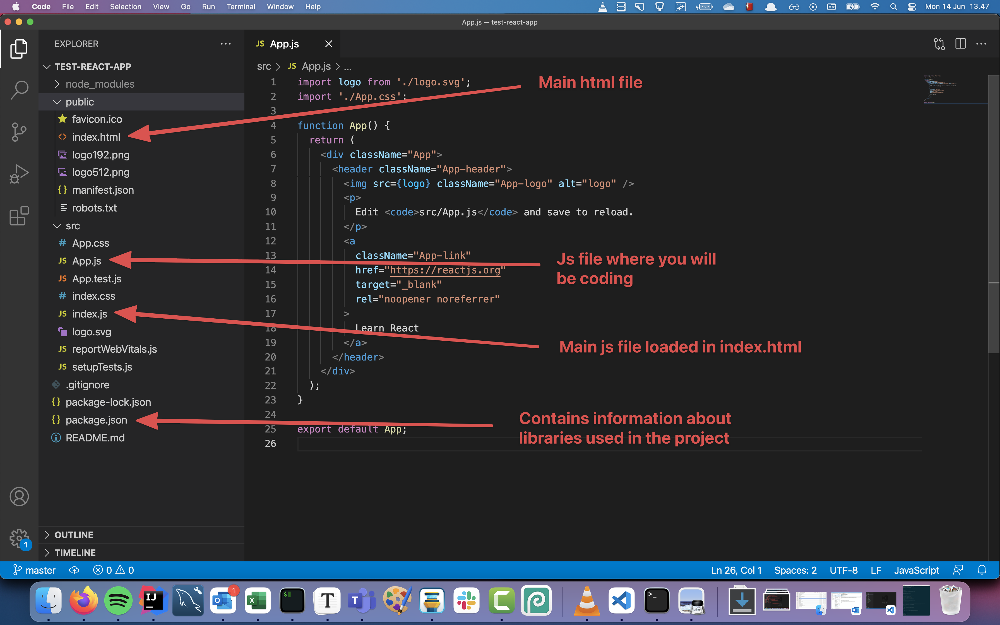

# Component model

- Create your first React app
- What is a component
- Component tree
- JSX
- Structure of React application
- Loops, keys
- Props


## What is react

React is a JavaScript library created by Facebook. It is used for  making complex, interactive user interfaces. It has become very popular  in the last 5 years.

Why has it become so popular?

- It is fast and efficient
- It is easy to understand & less verbose than the "vanilla" JS API
- It helps separate functionality into small, understandable pieces


## What is a component?

React heavily relies on a concept called "components". Components are like  small Lego blocks for designing and developing user interfaces (UI).  They can be stuck together in different ways to create new UI.

Let's have a look at an example: the GitHub header. What are the logical "pieces" of UI? What could be a component?


Here we've highlighted some elements that could be components:


### Component tips

There are no hard & fast rules for making components. UIs can be split up into components in many different ways, requiring judgement based on  your context.

- Components should follow the Single Responsibility Principle
  - Each component should only have 1 "responsibility"
  - Should only do 1 thing
- Components should have good, explicit names
  - This helps you to remember what the component's job is


#### Exercise A (estimate: 10 min)

##### 

##### Exercise

1. Look at the user interface below:


1. Draw boxes around the components and give them names. Compare with the example components shown in the second image.


## Create your first React app

The Facebook team behind React have created a tool to help you create and set up React projects. It is called [Create React App](https://create-react-app.dev/). The official documentation is available [here](https://create-react-app.dev/docs/getting-started).

Install & set up a Create React App by following the steps below:

1. Open your terminal and `cd` to where you keep your projects
2. In your terminal, run (this may take several minutes to complete):

```js
npx create-react-app my-app
cd my-app
npm start
```


## Structure of a React app

The structure of a React app should not be too foreign to you. It is a bit different though. 

In the `public` we can find files that is related to the html file. So fx if we wanted to change the `title` of the html page that would be done in the `public/index.html` file

In the `src` folder the files that you will be working on will be situated. You will mostly be using the `App.js` file to begin with. For now you can ignore the rest 🙈




## Rendering with React

Remember how annoying it was to manage the DOM yourself in [our previous lesson](https://syllabus.codeyourfuture.io/js-core-2/week-2/lesson)? The "vanilla" JavaScript APIs for updating the DOM are quite long and  difficult to remember. React makes this easier by manipulating each DOM  element itself, instead of you doing it manually. You give React a  "description" of the DOM that you want and it will update the DOM for  you. React *abstracts* away the management of the DOM.

Let's take a look at an example. We are going to walk through how to render a `<div>` with the text "Hello World" within it.

First, lets recap how we could do this using "vanilla" JS ([interactive version](https://jsbin.com/zexiyulavu/edit?html,output)):

```js
let divNode = document.createElement("div");
divNode.innerText = "Hello World";

let rootElement = document.querySelector("#root");
rootElement.appendChild(divNode);
```


Now let's convert to using React ([interactive version](https://jsbin.com/calaqitede/1/edit?html,output)):

````js
const element = React.createElement("div", {
  children: "Hello World",
});

const rootElement = document.querySelector("#root");
ReactDOM.render(element, rootElement);
````


## JSX

As you can see, React is already helping us a bit by cleaning up some of  the verbose vanilla JS APIs. However in a typical React application you  would still use a *lot* of the `React.createElement` function. To improve the developer experience the React team developed **JSX**.

JSX is a simple syntax *sugar* that looks like HTML, but is actually converted to the `React.createElement` function when you run it.

Using JSX ([interactive version](https://jsbin.com/gabujocuda/edit?html,output)):

```jsx
const element = <div>Hello World</div>;

const rootElement = document.querySelector("#root");

ReactDOM.render(element, rootElement);
```


As you can see, this is much easier to read than both the straight `React.createElement` API and the vanilla JS API. Most people using React use JSX to write their components.


#### Exercise B (estimate: 5 min)

Change the [JSX example from above](http://jsbin.com/gekahexige/edit?html,output) to instead render a `h1` tag with the text "Hello Code Your Future".


## React Components

We looked at the beginning of the lesson at the concept of components. Now let's look at how components are made in React.

```jsx
import React from "react";
import ReactDOM from "react-dom";

function HelloWorld() {
  return <div>Hello World</div>;
}

ReactDOM.render(<HelloWorld />, document.querySelector("#root"));
```


There are 3 important parts in this code:

1. First we import `React`. This is important because JSX is converted to `React.createElement` calls. If the `React` variable is undefined then this will fail.
2. We create a React component called `HelloWorld`.
3. We *render* the `HelloWorld` component into the element with the id of `root`.


#### Component Composition

A component can be combined with another component so that both are rendered. This is called *composition* ([interactive example](https://codesandbox.io/s/0x4wonqn00)):

```jsx
function Greeting() {
  return <span>Hello</span>;
}

function Mentor() {
  return <span>Ali</span>;
}

function HelloWorld() {
  return (
    <div>
      <Greeting />
      <Mentor />
    </div>
  );
}
```


In the `HelloWorld` component we are using a reference to the `Greeting` and `Mentor` components. React reads these references when rendering `HelloWorld` and so it renders the `Greeting` and `Mentor` *child* components.

We are also using some shorter syntax within the `HelloWorld` component. `<Greeting />` is just a shorter way of writing `<Greeting></Greeting>`, which is useful if we don't need to put anything inside the `Greeting` component.

Notice how the components that we write (`HelloWorld`, `Greeting`, `Mentor`) are written using a `camel case` convention and always start with an uppercase letter? And "regular DOM" components (`div`, `span`) are always lowercase? This is a convention to let you know whether you  are using a "regular DOM component" or a component that you have  written. When you're making your own components, you should always start them with an uppercase letter.

#### 

## Embedding JavaScript into JSX

So far all of the components we have looked at haven't been able to change - they are *hard-coded*. But this doesn't make very interesting websites, we want to be able to  use variables with different data. We can insert variables (and some  other things) into our React components.

Anything in the JSX that is inside curly braces `{}` is interpreted as a regular JavaScript *expression*. That means you can use every object or function from JavaScript that we have learned so far. Let's look at an example ([interactive example](https://codesandbox.io/s/interpolation-in-jsx-l910pqnjql)):

```jsx
function Greeting() {
  const greetingWord = "Hello";
  
  return <span>{greetingWord}</span>;
}
```


Now instead of hard-coding the greeting in the `Greeting` component, we are using a variable. Remember that everything between  the curly braces is just regular JavaScript. So we can use more than  just variables ([interactive example](https://codesandbox.io/s/interpolation-with-methods-in-jsx-nw29kzx744?file=/src/HelloWorld.js)):

```jsx
function Mentor() {
  const mentors = ["Ali", "Kash", "Davide", "German", "Gerald"];
  
  return <span>{mentors.join(", ")}</span>;
}
```


Now we have modified the `Mentor` component to use the `Array.join` method so that it lists several mentor's names. This also works with other JS types:

```jsx
function Weather() {
  const weatherData = {
    temperature: 5,
    location: "London",
  };

  return (
    <p>
      The temperature in {weatherData.location} is {weatherData.temperature}
    </p>
  );
}
```

```jsx
function formatName(user) {
  return user.firstName + " " + user.lastName;
}

function Name() {
  const user = {
    firstName: "Bob",
    lastName: "Marley",
  };

  return <span>{formatName(user)}</span>;
}
```


A common pattern in React is to use `Array.map` to loop through a list of items and render a component for each one ([interactive example](https://codesandbox.io/s/interpolation-with-map-in-jsx-7mw0mw3qx0?file=/src/MentorsList.js)):

```jsx
const mentors = ["Ali", "Kash", "Davide", "German", "Gerald"];

function MentorsList() {
  return (
    <ul>
      {mentors.map((name) => (
        <li>{name}</li>
      ))}
    </ul>
  );
}
```


Here we are using `Array.map` to turn an array of strings into an array of components.


## Keys

You may have noticed that we are now seeing a red error message in the Dev Tools: `Warning: Each child in a list should have a unique "key" prop.`. This error happens when you use `Array.map` to return a list of elements ([interactive example](https://codesandbox.io/s/key-prop-for-lists-in-react-pwp8ox4kn0?file=/src/MentorsList.js)):

```jsx
const mentors = ["Ali", "Sub", "Loic", "Anthony", "Lucy", "Mozart"];

function MentorsList() {
  return (
    <ul>
      {mentors.map((name, index) => (
        <li key={index}>{name}</li>
      ))}
    </ul>
  );
}
```


Here we have added a `key` prop to the `li` element. A documentation page explaining in more depth is in the further reading section but basically the `key` prop has a special meaning in React because it is used internally to keep track of which element in the list is which.


## Importing/Exporting Components

To help organise your code, components can be imported and exported just like any other JavaScript code ([interactive example](https://codesandbox.io/s/1z6xozl81l)):

```jsx
import Greeting from "./Greeting";
import Mentor from "./Mentor";

function HelloMentor() {
  return (
    <div>
      <Greeting />
      <Mentor />
    </div>
  );
}
```

```jsx
function Greeting() {
  return <span>Hello</span>;
}

export default Greeting;
```


We also need to export our components if we want to use them in other files:


The convention is to name component files exactly the same as the component (including the capital letter).


> Taken from https://syllabus.codeyourfuture.io/react/week-1/lesson


## Making an argument for Props

What's the problem with our `HelloMentor` component above?

The component `HelloMentor` is very static. What if we want to say *hello* to a different mentor? Currently, we would have to change the code too! This is easy in our tiny application but for "real" applications this  might be more difficult.

Instead wouldn't it be good if we could  change which mentor we are saying hello to every time we render the  component? So we could reuse the `HelloMentor` component for different mentor names. This is what *props* are for.


## What are Props?

Props are what we use in React to pass "arguments" to components. They are  very similar to arguments in functions - you can "pass" props to  components, and you can use those props within a component.

First let's look at passing props to your components ([interactive example](https://codesandbox.io/s/intro-to-props-vmjy0o91m7?file=/src/HelloMentor.js)):

```jsx
<Mentor name="Mozafar" />
```


As you can see props are key-value pairs, in this example the key is `name` and the value is the string `'Mozafar'`. We can pass as many props as we like to a component.

We don't have to use strings, we can use any valid JavaScript data like  numbers, arrays and objects. Remember that in JSX you can use curly  braces `{}` to inject data that is not a string:

```jsx
<Mentor age={30}>
```


Now let's take a look at using props that we have passed to a component ([interactive example](https://codesandbox.io/s/intro-to-props-vmjy0o91m7?file=/src/Mentor.js)):

```jsx
function Mentor(props) {
  console.log(props);
  return <span>{props.name}</span>;
}
```


React gives you access to props in the **first argument** to the component function. We can then inject props into our component using curly braces.

The `props` variable is just a normal object with key-value pairs that match what  was passed to the component. Because it is just a variable, it can be  used like any other variable. That includes injecting props into  attributes:

```jsx
<div id={"mentor-id-" + props.id}>{props.name}</div>
```

Or calculating new values

```jsx
<div>{props.age + 1}</div>
```


